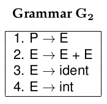
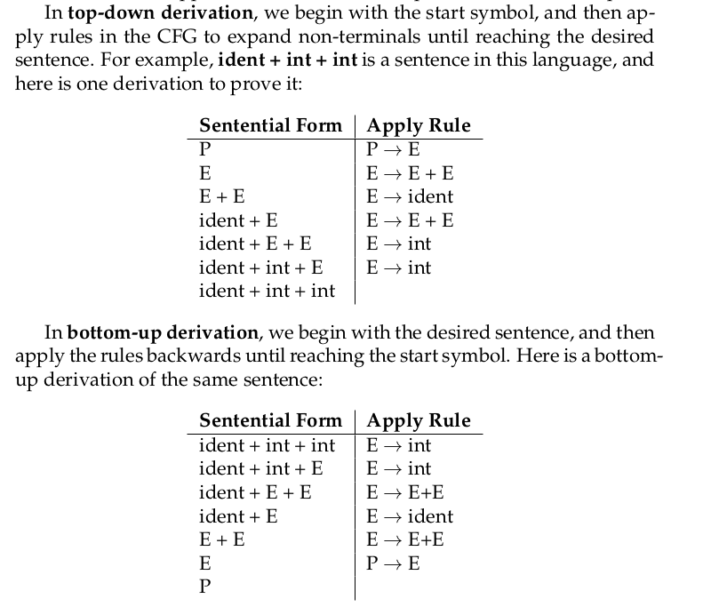
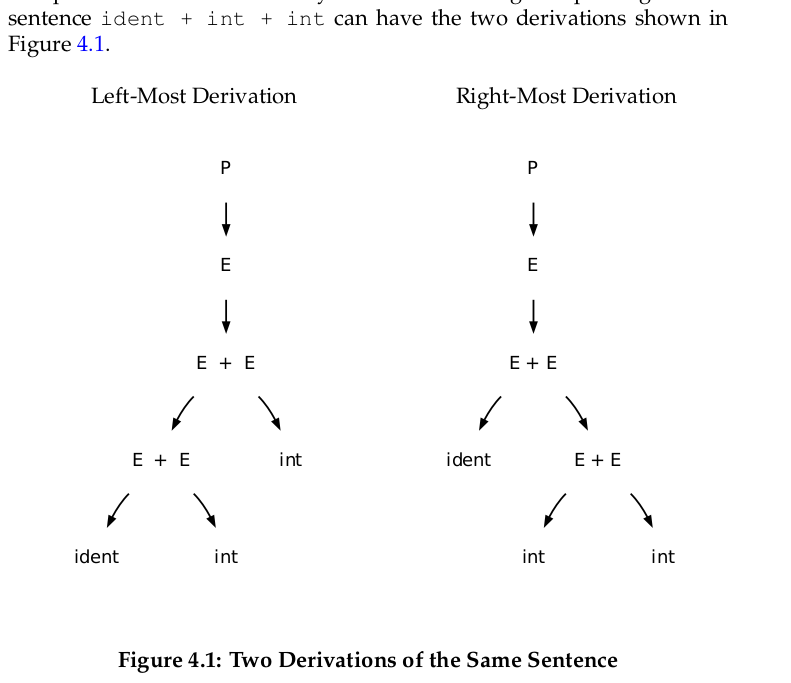
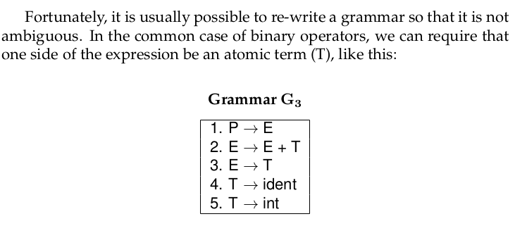

# Chapter 1 - Introduction

## What is a compiler?
- Compiler translates a progrma in a source lanugage to a progrmam in target language.
- Compiler exist not only to translate rpograms, but also to improve them. Helps finding erros at compile time.
- Intepreter reads in a program and then executes it directlym without emitting a translation.

# Chapter 2 - A quick tour
## 2.1 Preprocessor > Compiler > Assembler > Static Linker > Dynamic Linker
1. Preprocessor prepares the cource code for the compiler proper.
2. Compiler proper consumers the clean output of the preporcessor. It scans and parses the source code, performs typeschecking and other semantic routines, optimizes the code, tand then produces assembly language as the output.
3. The assembler consumes the assembly code and produces object code. Object code is "almost executable" in that it contains raw machine language intructions in the form needed by the CPU.
4. The linker consumes one or more object files and library files and combines them ino a complete, executable program

## 2.2 Stages within a compiler

Character Stream -> [Scanner] -Tokens-> [Parser]  -Abstract Syntax Tree-> [Semantic Routin] -Intermediate Representation-> [Optimizer] -> [Code Genreator] -> [Assembly Code]

1. The scanner consumes the plain text of a program and groups together individual characters to form complete tokens.
2. The parser consumes tokens and groups them together into complete statements and expressions, much liek words are grouped into sentences in a natural lauguage.
3. The semantic routines traverse the AST and derive additional meaning about the program form the rules of the lanugage and the relationship bteween elmenents of the program.
    eg: we determine that *x+10* is a *float* expression by observing the type of *x* from an eralier declartion, then applying the language rule that additon between *int* and *float* values yields a float.
4. One or more **optimizers** can be applied to the intermediate representation, in order to make the prgoram smaller, faster, or more efficient.

- Each line of the grammar is called a *rule*, and explains how various parts of the language are constructed.
- Rule 1-3 indecate that an expression can be formed by joining two expressions weith operatiors.
- Rule 4 describes a functuin call
- Rule 5 describes the use of parentheses.
- Rules 6 and 7 indicate that identifiier and intergers are atomic experssions.

- The parser looks for sequences of tokens that can be replaced by the left side of a rule in our grammar. Each time a rule is applied, the parser creates a node in a tree, and connects the sub-expressions into the abstract syntax tree (AST).
- With this data structure in place, we are now prepared to analyze the meaning of the program. The semantic routines traverse the AST and de- rive additional meaning by relating parts of the program to each other and to the definition of the programming language. An important component of this process is typechecking, in which the type of each expression is determined, and checked for consistency with the rest of the program. To keep things simple here, we will assume that all of our variables are plain integers.
- To generate linear intermediate code, we perform a post-order traver- sal of the AST and generate an IR instruction for each node in the tree.

- The intermediate reprentation is where most forms of optimization occur. Dead code is removed, common operations are cmbined, and code is generally simplified to consume fewer resources and run more quicky
- Finally, the intermediate code must be converted to the desired assembly code.

# Chapter 3 - Scanning
## 3.1 Kinds of tokens
1. **Keywords** are words in thel anguage strucutre itself, like *while* or *class* or *true*.
2. **Identifiers** are the names of variables, functions, classes, and other code elements chosen by the programmer.
Typically, identifiers are  arbitrary sequences of letters and possibly numbers
3. **Numbers** could be formatted as integers, or floating point values, or fractions, or in alternate bases such as binary, octal or hexadecimal.
4. **Strings** are literal character sequnces that mus be clearly distinquished from keywords or identifiers.
Quoted with single or double quotes.
5. **Comments** and **Whitespace** are used to format a program to make it visually clear, and in some case are significant to the structure of a program
## 3.3 Regular Expressions
## 3.4 Finite Automata
- A **finite automation (FA)** is an abstract machine that can be used to represent centain formsof computation.
Graphically, an FA consists of a number of states and a number of edges between states.
States: starting states, accepting states

## 3.4.1 Deterministic Finite Automata
- The above example is a DFA. DFA is a special case of anFA where every state has no more than one outgoing edge for a given symbol.
Or, a DFA has no ambiguity: for every combination of state and input symbol, there is exactly one choice of what to do next.
- Because of this property, a DFA is very easy to implement in software and hardware.

## 3.4.2 Nondeterministic Finite Automata
- The alternative of DFA.
- AN NFA is a perfectly valid FA, but it has an ambiguity that mkes it somewhat more difficult to work with.

- Now consider how this automaton would consume the word sing. It
could proceed in two different ways. One would be to move to state 0 on
s, state 1 on i, state 2 on n, and state 3 on g. But the other, equally valid
way would be to stay in state 0 the whole time, matching each letter to the
[a-z] transition. Both ways obey the transition rules, but one results in
acceptance, while the other results in rejection.

- The problem here is that state 0 allows for two different transitions on
the symbol i. One is to stay in state 0 matching [a-z] and the other is to
move to state 1 matching i.

- Moreover, there is no simple rule by which we can pick one path or
another. If the input is sing, the right solution is to proceed immediately
from state zero to state one on i. But if the input is singing, then we
should stay in state zero for the first ing and proceed to state one for the
second ing .

## 3.5 Conversion Algorithm

RE and FA are all equally powerful. For every RE, there is an FA, and vice versa. However, a DFA is by far the most straightforward
of the three to implement in software.

## 3.5.1 Converting REs to NFAs

To convert a RE to NFA, we can follow an algorithm  given first by McNaughton and Yamada, and then Ken Thompson.
We follow the same inductive definition of RE as given ealier, First, we define automata corresponding to the base casdes of REs:

Now, suppose that we have already constructed NFAs for the regular expressions A and B, indicated below by rectangles. Both A and B have a signle start
state (on the left) and accapting state (on the right). If we write the concatenation of A and B as AB, then the corresponding NFA is simply A and B connected by and $epsilon$
transition. The start state of A becomes the starte state of the combination, and the accepting state of B becomes the accpting state of the combination.

In a similkar fashion, the alternation of A and B written ias A|B can be expressed as two aujtomata joined by common
starting and accepting nodes, all connected by epsilon transitions:

Finally, the Kleene closure A* is constructed by taking the automaton for A, adding starting and accepting nodes, then adding epsilon transitions to allow zero
or more repetitions:

## 3.5.2 Converting NFAs to DFAs
We can convert any NFA into an equivalent DFA using the technique of **subset construction**. The basic idea is to create a DFA such that each state in the
DFA corresponds to multiple states in the NFA, accorading to the "many-words" interpretion.

Suppose that we begin with an NFA consisting

# Parsing
A **terminal** is a discrete symbol that can apppear in the languagem otherwise known as a token from the prevous chapter
eg: keywords, operators, and identifiers. We will use lower-case to reppresent.

A **non-terminal** represents a strucutre that can occur in the lanugage,but is not a literal symbol.
eg: declarations, statements, and expressions. We will use upper-case to represent: *P* for program, *S* for statement, *E* for expression.

A **sentences** is a valid sequence of terminals in a language, while a **sentential form** is a valid sequence of termnials and non-terminals.
use &alpha; &beta; &gamma;

A **context-free grammar (CFG)** is a list of **rules** that formally describe the allowable sentences in a language.
The left-hand side of each rule is always a single non-terminal. The right-hand side of a rule is sentential form that describes and allowable form of that
non-terminal.

- (1) A complete program consists of one expression.
- (2) An expression can be any expression plus any expression.
- (3) An expression can e an identifier
- (4) An expression can be an an integer literal

Or like this,
    E &rarr; E &plus; E|ident|int

## 4.2.1 Deriving Sentences

For example,

- E &rArr; int by apply ing rule 4 of Grammar G2
- E + E &rArr; E + ident by apply rule 3 of Grammar G2
- P &rArr; int + idnent by applying all rules of Grammar G2

There are two appoaches to derivation: top-down and bottom-up:

## Ambiguous Grammars

An **ambiguous grammar allows for more than one possible derivation of the same sentence.

example:
hello + 5 + 5 = hello55
              = hello10

